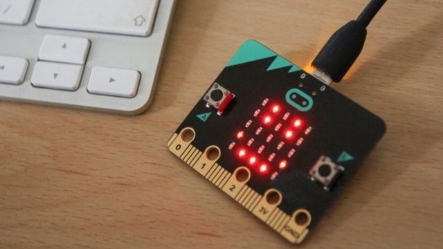

# Microbit
## Introduccion
## ¿Qué es STEAM? ¿Qué es una placa Microbit?
- El término STEAM surge de las siglas en inglés de:  Science, Technology, Engineering, Arts & Mathematics.
- Es un dispositivo del tamaño de una tarjeta de crédito, compuesto por un ordenador de placa única (SBC) que cuenta con diversos sensores, varias entradas para anexar otros elementos de hardware y conexión inalámbrica mediante Bluetooth.

## [1.- Módulo1: La placa Microbit y sus elementos](modulo1/modulo1.md)
## [2.-Módulo2: Programación básica  1](modulo2/modulo2.md)
## [3.- Modulo 3: Programación básica 2](modulo3/modulo3.md)
## [4.- Modulo 4: Ampliación](modulo4/modulo4.md)
## [5.- Proyecto](proyecto.md)
## [Referencias](referencias.md)
## Autores
Realizado por Paula Brito Milán
## Licencia

