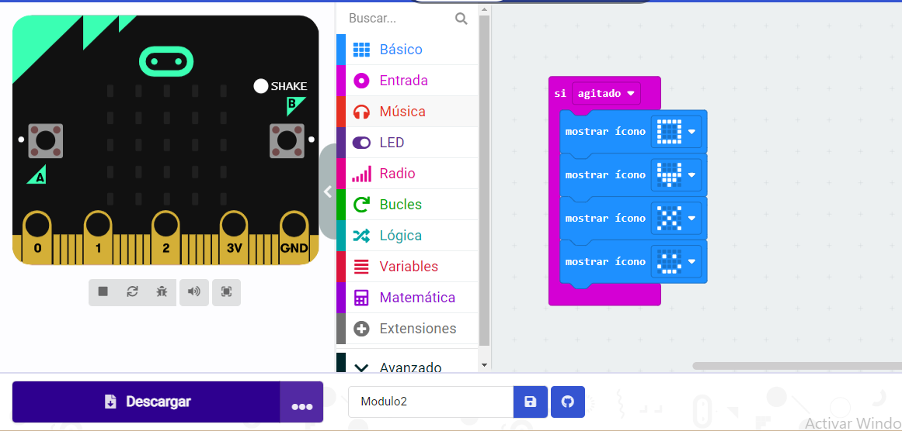
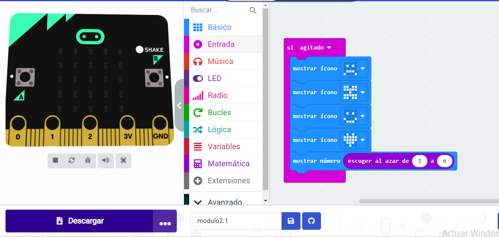
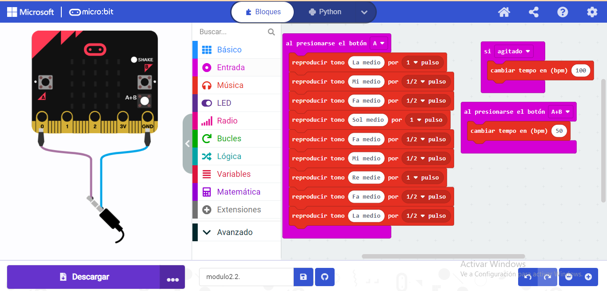

## Actividad 1
A continuación, detallamos los pasos a seguir para que la placa muestre un
cuadrado al agitar la placa:
Si “agitado”
mostrar icono (cuadrado)
Para completar la actividad nos proponen que esta vez al agítala muestre un
cuadrado girado:Si “agitado:
mostrar icono (cuadrado)
mostrar icono (rombo)
mostrar icono (cuadrado)
mostrar icono (rombo)
 
 [modulo2.hex](Modulo2.hex)

## Actividad 2
A continuación, detallamos los pasos a seguir para ampliar la programación y
convertir nuestra animación en un dado.
Para ello debemos añadir a continuación de la animación del dado que nos
muestre en pantalla un número aleatorio entre el 1 y el 6:
El conjunto de bloques sería el siguiente:
Si “agitado:
mostrar icono (cuadrado)
mostrar icono (rombo)
mostrar icono (cuadrado)
mostrar icono (rombo)
mostrar número “escoger al azar de 1 a 6”
 
 
 [modulo2.1.hex](modulo21.hex)

## Actividad 3
Como último ejercicio, se nos pide que toquemos en la placa la primera parte de
una melodía al presionar el botón A.
Para completar la actividad, primero trasladaremos la primera parte del
pentagrama a notas:
LA MI FA SOL FA MI RE RE FA LA SOL FA MI MI FA SOL LA RE RE
A continuación, programaremos en la placa para que al presionar el botón suene
la melodía programando tono a tono teniendo en cuenta de su se trata de un tono
de un pulso, de medio pulso o de dos pulsos:
 
 [modulo2.2.hex](modulo22.hex)

