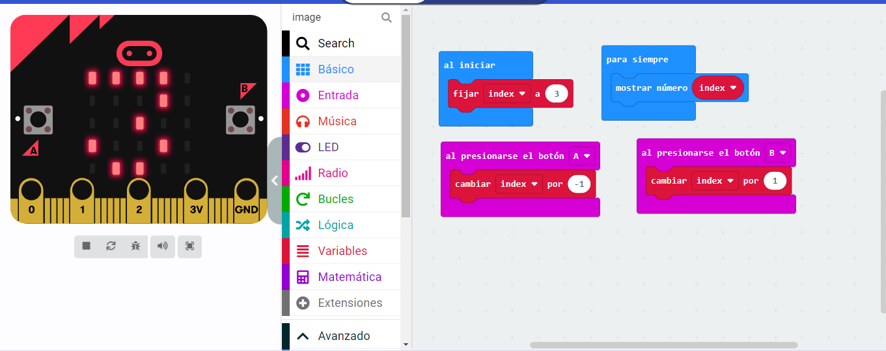
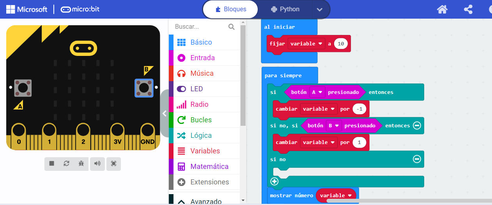
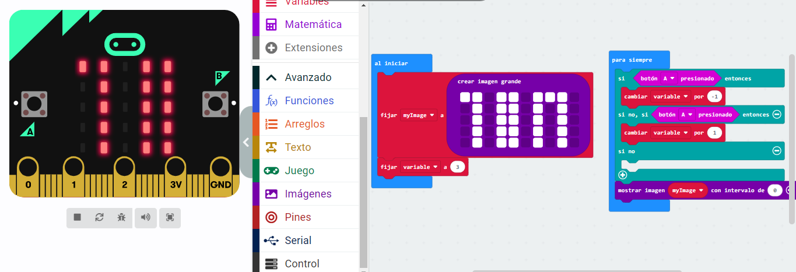

## Actividad 1
Para crea una variable y programar la placa Micro:bit para que, al presionar el
botón B, la variable aumente y, al presionar el botón A, la variable disminuya,
deberemos seguir los siguientes pasos:
A continuación, se detallan los pasos a seguir para resolver la actividad 1:
1. Para utilizar una variable, comenzamos por crearla haciendo clic en el botón
“Crear variable”.
2. Una vez creada, le asignamos un valor inicial en el interior del bloque “al
iniciar”, utilizando el bloque “establecer variable para”. Asignaremos un
valor inicial de, por ejemplo, 3.
3. A continuación, utilizaremos los bloques de entrada para programar el
cambio de la variable al presionar los botones A y B. Realizaremos estos
cambios utilizando los bloques “cambiar variable por”, sumando 1 al
presionar botón B, y sumando -1 al presionar el botón A.
Actividad 1 - Ampliación
4. Por último, no debemos olvidar mostrar la variable en la pantalla de la placa.
Para hacerlo de manera continua, colocaremos el bloque “mostrar número”
en el interior del bloque “para siempre”.

 
 [modulo3.hex](modulo3.hex)
## Ampliacion Actividad 1
Para hacer que el cambio de la variable sea continuo, lo incluimos en el bloque
“para siempre” con una condición: si el botón A está presionado, cambiamos la
variable en -1. De igual modo, si el botón B está presionado, cambiamos la variable
en 1 unidad. En caso contrario, no modificamos la variable.
A continuación, se detallan los pasos a seguir para resolver la ampliación:
1. Al ejecutar el programa en la placa o en el simulador, observamos que el
valor de la variable no cambia de manera continua: al mantener el botón
presionado, la variable se mantiene estable, y es necesario soltarlo y volver
a presionarlo para que su valor siga cambiando.
2. Para hacer que el cambio de la variable sea continuo, lo incluimos en el
bloque “para siempre” con una condición: si el botón A está presionado,
cambiamos la variable en -1. De igual modo, si el botón B está presionado,
cambiamos la variable en 1 unidad. En caso contrario, no modificamos la
variable.

 
 [modulo1.hex](modulo31.hex)
## Actividad 2
Para crear una imagen grande y programar la placa para que inicialmente se
muestre la parte central de la imagen y, al presionar los botones A y B, la imagen
se deslice a la izquierda o a la derecha, respectivamente, deberás seguir los
siguientes pasos:
Para comenzar, descomponemos la actividad en retos sencillos. Existen muchas
posibilidades, una de ellas sería:
a) Crear la imagen y almacenarla en una variable.
b) Crear una variable con la que mover la imagen dándole valores
ascendientes o descendientes, en función de si se presionan los
botones.
c) Mostrar la imagen en la pantalla de la placa.

 
 [modulo1.hex](modulo32.hex)
