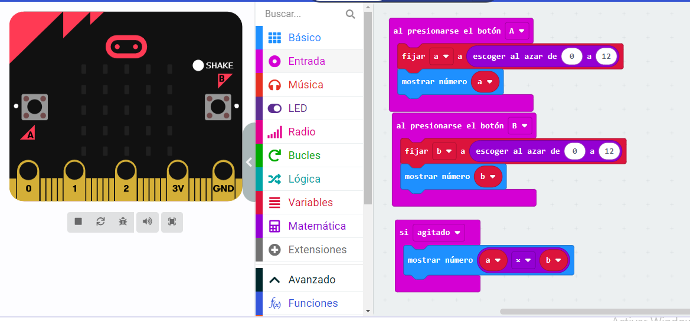

## Tabla de multiplicar 
El programa usa dos variables llamadas “a” y “b” para almacenar números aleatorios.
Las variables almacenan números o valores que pueden cambiar en un programa de computadora.
Presione el botón A para generar un número aleatorio entre 0 y 12 para la variable “a” y mostrarlo en la pantalla LED. Presione el botón B para generar otro número aleatorio entre 0 y 12 para "b" y mostrarlo en la pantalla LED.
Agite el micro: bit para averiguar cuál es el producto: esa sería la respuesta si los números se multiplicaran. Esta parte del programa funciona usando el bloque de multiplicación del menú de matemáticas en MakeCode.

[modulo4.hex](modulo4.hex)

Paula Brito Milán
